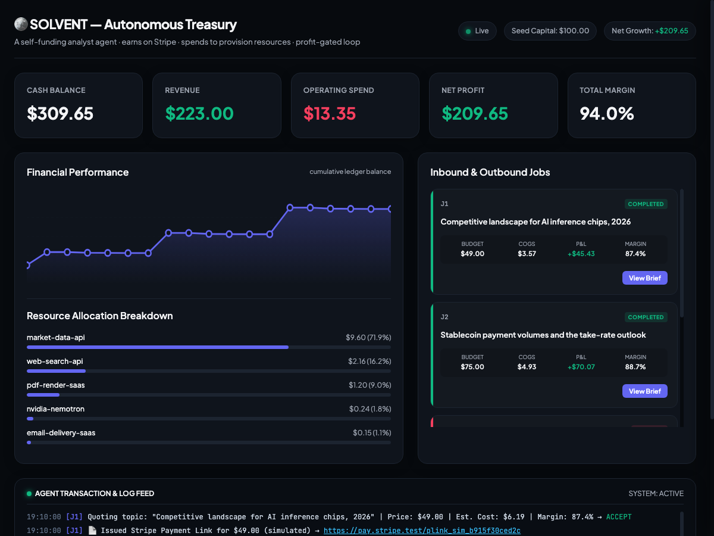

<div align="center">

# 🪙 SOLVENT

**An AI agent that runs as a profitable, self-funding business.**

It sells research briefs. It collects payment on Stripe. It spends its own revenue to provision the compute it needs. And it refuses any job that doesn't clear a margin.

[](https://www.python.org/downloads/)
[](LICENSE)
[](https://www.nvidia.com)
[](https://github.com/ianalloway/solvent-agent/stargazers)

[**Quick Start**](#-quick-start) · [**How It Works**](#-how-it-works) · [**Live Demo**](#-the-demo) · [**Make It Real**](#-make-it-real)

</div>

---

## The Big Idea

Most agents can spend money. Almost none can **run as a business.**

SOLVENT closes the full loop:

```
  Client pays Stripe → Agent earns revenue → Agent fulfils the work
  → Agent pays its own vendor bills → P&L booked → balance sheet grows
```

Every job is **profit-gated before it starts**. Unprofitable work is declined without touching Stripe. Vendor payments are screened by a NemoClaw-style policy sandbox. The agent literally cannot spend more than it earns.

---

## 🚀 Quick Start

**Zero dependencies. No API keys. Works right now.**

```bash
git clone https://github.com/ianalloway/solvent-agent.git
cd solvent-agent
python3 run_demo.py
```

The agent will run a full batch of 4 analyst jobs — complete with margin gating, Stripe payment simulation, NVIDIA Nemotron fulfillment, guardrail screening, and live P&L — in about 30 seconds.

> **First run**: A short onboarding wizard asks you to choose a model, interaction mode, and whether to enable Stripe test mode. Preferences are saved to `.solvent/config.json` and never committed.

---

## 📊 The Demo

After a run, open the live treasury dashboard:

```bash
open treasury_dashboard.html   # macOS
```



A typical batch session:

| Metric | Value |
|---|---|
| Revenue | **$223.00** |
| Operating spend | $13.35 |
| **Net profit** | **$209.65** |
| Margin | **94%** |
| Jobs declined | 1 (below margin floor) |

---

## ⚙️ How It Works

```
 inbound job
     │
     ▼
 ┌─────────────┐   margin < floor?  ┌───────────┐
 │  MARGIN GATE│ ─────────────────▶ │  DECLINE  │
 │  (pricing)  │                    └───────────┘
 └─────┬───────┘ accept
       ▼
 ┌─────────────┐   EARN
 │   STRIPE    │ ── Payment Link → poll/webhook until paid ──▶ + revenue
 └─────┬───────┘    (records cs_... + pi_... on ledger)
       ▼
 ┌─────────────┐   FULFIL
 │  NEMOTRON   │ ── Llama-3.1-Nemotron-Ultra produces the brief ──▶ resource usage
 └─────┬───────┘
       ▼
 ┌─────────────┐   SPEND (every payment screened first)
 │ GUARDRAILS  │ ── NemoClaw policy: allowlist · caps · reserve · ROI
 │   → STRIPE  │ ── Issuing virtual card (test) or simulated spend ──▶ − expense
 └─────┬───────┘
       ▼
   BOOK P&L  ──▶ treasury updated · dashboard refreshed
```

Revenue is **always collected before cost is incurred**, and no payment can violate policy. The business is safe by construction and profitable by rule.

---

## 🏗️ Architecture

| Layer | Technology | File |
|---|---|---|
| **Analyst / reasoning** | NVIDIA Nemotron (Llama-3.1-Nemotron-Ultra) | `solvent/nemotron.py` |
| **Spend safety** | NVIDIA NemoClaw-style policy sandbox | `solvent/guardrails.py` |
| **Earn** | Stripe Payment Links + Checkout Session polling | `solvent/stripe_client.py` |
| **Spend** | Stripe Issuing virtual cards (test mode) | `solvent/stripe_client.py` |
| **Orchestration** | Hermes / Nous tool-calling agent loop | `solvent/agent.py` |
| **Memory** | SQLite treasury + pricing ledger | `solvent/treasury.py` · `solvent/pricing.py` |

**Key design choices:**

- **Structural profitability** — `pricing.py` computes unit cost before quoting. If margin < floor, the job never reaches Stripe.
- **Spend policy** — `guardrails.py` enforces vendor allowlist, per-transaction cap, rolling 24h budget, minimum cash reserve, and no-negative-ROI rule.
- **Offline-first** — without API keys the demo runs on deterministic stubs. Add `NVIDIA_API_KEY` + `STRIPE_API_KEY=sk_test_...` to unlock live inference and real Payment Links.
- **Audit trail** — every `cs_...` checkout session ID and `pi_...` PaymentIntent ID is recorded on the ledger before fulfilment begins.

---

## 🎮 Running Modes

### Batch demo (default — best for judges)

```bash
python3 run_demo.py
```

4 pre-loaded jobs. ~30 seconds. Shows margin gating, Stripe earn/spend, Nemotron fulfillment, and guardrails in action.

### Interactive — your own jobs

```bash
python3 run_demo.py --interactive
```

Type a research topic and client budget at the prompt. The agent quotes, pays, fulfils, and books P&L for each one in real time. Keep going until you quit.

### Add funds mid-session

```bash
python3 run_demo.py --seed 500        # start with $500 instead of $100
python3 run_demo.py --keep-balance    # resume existing treasury balance
```

In interactive mode, type `/fund 200` at the prompt to deposit $200 into the live treasury without restarting.

### Programmatic

```python
from solvent.agent import Solvent
from solvent.jobs import SAMPLE_JOBS

agent = Solvent(seed_cents=10_000)          # reset treasury, seed $100
agent.handle_job(SAMPLE_JOBS[0])            # process one job
snap = agent.run(SAMPLE_JOBS[1:])           # process a list; returns snapshot

print(snap["balance_cents"], snap["margin_pct"])
```

### Guardrails demo (standalone)

```bash
python3 demo_guardrails.py
```

Shows five spend attempts and which ones the NemoClaw-style policy blocks — without starting the agent or touching Stripe.

### Production mode (webhooks + async worker)

```bash
pip install -r requirements.txt -r requirements-serve.txt

python3 -m solvent serve --port 8787   # webhooks + job API + hosted briefs
python3 -m solvent worker              # resume incomplete jobs, process queue

# Interactive voice dashboard (chat + live SSE updates):
open http://127.0.0.1:8787/

# Or dev convenience:
python3 run_demo.py --serve --no-onboard
```

The hosted dashboard at `/` includes a **chat panel** (type or use the mic with Web Speech API) and **live treasury updates** via Server-Sent Events (`/api/events`). Chat hits `/api/chat`, which routes through the Nemotron agent loop.

See [docs/PRODUCTION.md](docs/PRODUCTION.md) for Stripe webhook setup, SMTP delivery, reconciliation, and auto-tuning.

### Operations

```bash
python3 -m solvent reconcile --since 7d   # Stripe ↔ ledger drift check
python3 -m solvent tune                   # propose pricing improvements (dry-run)
python3 -m solvent tune --apply             # apply after 5+ completed jobs
python3 -m solvent finance                # income statement, unit economics, runway
python3 -m solvent finance --json         # machine-readable report
python3 -m solvent finance --reserve 50   # runway to a $50 cash-reserve floor
python3 -m solvent finance --period week  # net P&L trend by day | week | month
python3 -m solvent finance --horizon 60   # forecast the balance 60 days out
```

`finance` (alias `report`) turns the treasury ledger into the numbers a
business steers by: revenue/cost/net-margin, average profit per job, a cash
**runway** — days of burn remaining, or `cash-flow positive` once the agent
funds itself — a **net-P&L trend** bucketed by day/week/month, and a
**balance forecast** (central projection with a best/worst band whose width
grows with daily volatility). The income statement, runway, trend, and
forecast also render as a **Financial Statement** panel in the HTML dashboard.

---

## 🔑 Make It Real

To use live Nemotron inference and real Stripe test-mode payment links:

```bash
pip install -r requirements.txt

export NVIDIA_API_KEY=nvapi-...        # from build.nvidia.com
export STRIPE_API_KEY=sk_test_...      # Stripe test mode only (live keys refused)

python3 run_demo.py
```

With both keys set:

- Briefs are written by **NVIDIA Nemotron** (Llama-3.1-Nemotron-Ultra).
- Each job creates a real **Stripe Payment Link**. Pay with test card `4242 4242 4242 4242`.
- SOLVENT **polls** the Checkout Session (`cs_...`) until `payment_status == paid` before fulfilling — no instant confirm.
- Optional: set `STRIPE_WEBHOOK_SECRET` and forward `checkout.session.completed` events via `StripeClient.process_webhook()`.
- Optional: enable **Stripe Issuing** on your test account to provision capped single-use virtual debit cards for each vendor payment.

### Environment variables

| Variable | Purpose |
|---|---|
| `NVIDIA_API_KEY` | Live Nemotron inference (`nvapi-...`) |
| `STRIPE_API_KEY` | Stripe test key (`sk_test_...`) |
| `STRIPE_WEBHOOK_SECRET` | Optional webhook verification |
| `STRIPE_PAYMENT_POLL_TIMEOUT` | Seconds to wait for payment (default `120`) |
| `STRIPE_PAYMENT_POLL_INTERVAL` | Poll interval in seconds (default `2`) |
| `SOLVENT_FORCE_STRIPE_SIMULATE` | Force offline simulate mode even with a key |
| `TELEGRAM_BOT_TOKEN` | Telegram bot token from BotFather |
| `SOLVENT_TELEGRAM_DM_POLICY` | `pairing` · `allowlist` · `open` (default `pairing`) |
| `SOLVENT_TELEGRAM_ALLOW_FROM` | Comma-separated Telegram user IDs for allowlist mode |

Product/Price objects are cached in `.solvent/stripe_catalog.json` so repeated runs reuse a single **SOLVENT Research Brief** product instead of cluttering your Stripe dashboard.

---

## 💬 Telegram (conversational channel)

Full chat on Telegram with OpenClaw-style pairing and Hermes-style tool/memory patterns. See **[docs/TELEGRAM.md](docs/TELEGRAM.md)**.

```bash
pip install -r requirements-telegram.txt
export TELEGRAM_BOT_TOKEN=...

python -m solvent serve &    # Stripe webhooks + checkout
python -m solvent worker &   # fulfill jobs
python -m solvent telegram     # long-poll bot

python -m solvent doctor       # diagnostics
python -m solvent pairing list # pending DM codes
```

Users pair via `/start`, commission briefs in natural language, receive checkout links, and get push updates when jobs are paid and delivered.

Personality and operating rules come from the **agent workspace** (`SOUL.md`, `BRAIN.md`, `AGENTS.md`) — see **[docs/WORKSPACE.md](docs/WORKSPACE.md)**.

---

## 🧪 Tests

```bash
pip install pytest
python3 -m pytest tests/ -v
```

Unit tests cover: pricing & margin gate · guardrail policy · treasury ledger · Stripe client (simulate + test mode) · config/onboarding.

---

## 📁 Repository Layout

```
solvent/
  agent.py         the orchestrator (earn → fulfil → spend → book)
  treasury.py      SQLite ledger / balance sheet
  pricing.py       the margin gate
  guardrails.py    NemoClaw-style spend policy
  stripe_client.py two-sided Stripe layer (earn + spend)
  nemotron.py      NVIDIA Nemotron client (+ offline stub)
  service.py       the product: an on-demand research brief
  jobs.py          sample inbound work
  dashboard.py     renders the treasury to HTML + JSON
  config.py        onboarding wizard and config persistence
  gateway.py       channel router (Telegram → chat sessions)
  chat.py          conversational loop + business tools
  memory.py        Hermes-style session memory
  hermes_tools.py  progressive tool disclosure bridge
  doctor.py        stack diagnostics
  workspace.py     SOUL/BRAIN/AGENTS prompt assembly
  channels/        Telegram long-poll adapter
run_demo.py        the full business loop (CLI entry point)
demo_guardrails.py the safety story (standalone)
tests/             pytest suite
docs/              screenshots and supporting assets
```

---

## 🏆 Built For

**Hermes Agent Accelerated Business Hackathon** — NVIDIA × Stripe × Nous Research

The agent was designed to demonstrate:

- An agent that is **economically self-aware** — it has a treasury, prices against its own costs, and gates every action on projected profit
- A **complete two-sided Stripe integration** — earns via Payment Links, spends via Issuing virtual cards
- **Provable spend safety** — a NemoClaw-style policy sandbox that makes "give an agent a payment credential" a reasonable thing to do
- **Live inference with NVIDIA Nemotron** — the offline stub means the demo always works, even without API keys

---

## 🤝 Contributing

Issues, PRs, and ideas are very welcome. Some good starting points:

- Add more sample research topics in `solvent/jobs.py`
- Improve the Nemotron prompt template in `solvent/service.py`
- Add a new guardrail policy to `solvent/guardrails.py`
- Extend the dashboard with charts or new metrics in `solvent/dashboard.py`

---

<div align="center">

**If SOLVENT gave you ideas, give it a ⭐**

</div>
