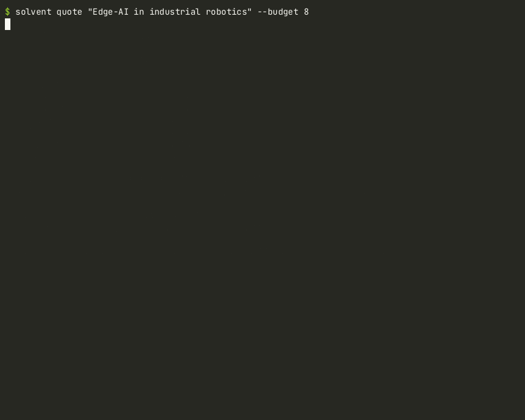
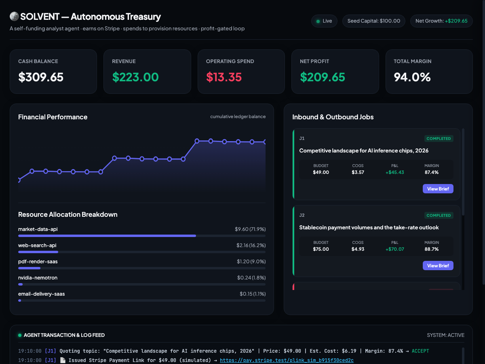

<div align="center">

# 🪙 SOLVENT

**A Python agent that runs a tiny research business: it quotes each job against its own costs, gets paid through Stripe, pays its own vendor bills within a spend policy, and declines work that would lose money.**

[](https://github.com/ianalloway/solvent-agent/actions/workflows/ci.yml)
[](https://pypi.org/project/solvent-agent/)
[](https://www.python.org/downloads/)
[](pyproject.toml)
[](LICENSE)
[](https://www.linkedin.com/posts/nousresearch_the-hermes-agent-accelerated-business-hackathon-activity-7472690765933072384-MW7G)
[](https://github.com/ianalloway/solvent-agent/stargazers)

[**Quick Start**](#-quick-start) · [**How It Works**](#-how-it-works) · [**Live Demo**](#-the-demo) · [**Make It Real**](#-make-it-real)



<sub>Recorded from the real CLI with no API keys and no network access: the Stripe checkout links and Nemotron output are the built-in offline stubs, and the dollar figures are simulated.</sub>

</div>

> **Demo by default.** With no keys set, `solvent` runs an **offline, zero-key simulation** of the whole loop. Dollar figures in the demo are illustrative, **not production revenue**. Stripe test-mode Payment Links and live NVIDIA Nemotron are opt-in; see [Make It Real](#-make-it-real).

---

## 🚀 Quick Start

**30 seconds. No API keys. No dependencies beyond Python 3.10+.**

```bash
pipx install solvent-agent      # or: pip install solvent-agent
solvent --no-onboard            # run the offline demo batch (skip the first-run wizard)
solvent finance                 # income statement, unit economics, runway
```

Then open the dashboard path the demo prints (`~/.solvent/treasury_dashboard.html`
for a pip/pipx install, or under `$SOLVENT_HOME` if you set it).

> **Newer commands.** PyPI currently ships 0.1.0. Commands added since then (`quote`,
> `products`, `backlog`, `customers`, `costs`, `simulate`, `guardrails`, …) need an
> install from `main` until the next release:
>
> ```bash
> pipx install git+https://github.com/ianalloway/solvent-agent
> solvent quote "Edge-AI in industrial robotics" --budget 8   # dry-run the margin gate
> ```

| Command | What it does |
|---|---|
| `solvent` | batch demo (onboarding wizard on first run; `--no-onboard` skips it) |
| `solvent init` | create data dirs, treasury DB, and workspace files |
| `solvent status` | live treasury summary (`--watch` to auto-refresh) |
| `solvent finance` | income statement, unit economics, runway, forecast |
| `solvent doctor` | diagnostics: API keys, extras, workspace files |
| `solvent serve` | webhooks + job API + hosted dashboard (`[serve]` extra) |
| `solvent worker` | resume incomplete jobs / process the queue |
| `solvent jobs` | list / show / retry / cancel jobs (`jobs --help`) |
| `solvent help` | every command |

Or run from a source checkout:

```bash
git clone https://github.com/ianalloway/solvent-agent.git
cd solvent-agent
python3 run_demo.py              # batch demo (onboarding wizard on first run)
python3 run_demo.py --no-onboard # skip wizard when scripting
pip install -e .                 # editable install from a checkout
```

The demo runs a batch of 5 sample analyst jobs (4 accepted, 1 declined by the margin gate) through margin gating, simulated Stripe payment, Nemotron fulfilment (offline stub), guardrail screening, and live P&L, in about 30 seconds.

Third-party features are **opt-in extras**, so install only what you need:

```bash
pip install "solvent-agent[stripe]"    # real Stripe test-mode payment links
pip install "solvent-agent[serve]"     # FastAPI webhooks + hosted briefs
pip install "solvent-agent[telegram]"  # Telegram bot channel
pip install "solvent-agent[qr]"        # scannable QR codes for OpenClaw pairing
pip install "solvent-agent[dev]"       # pytest, for running the test suite
pip install "solvent-agent[all]"       # everything
```

When run from a source checkout, runtime data stays under `<repo>/data`. When
installed elsewhere, SOLVENT writes to `~/.solvent` instead of into
`site-packages`; override either with `SOLVENT_HOME=/path/to/dir`.

> **First run**: A short onboarding wizard asks you to choose a model, interaction mode, and whether to enable Stripe test mode. Preferences are saved to `.solvent/config.json` and never committed.

---

## The Big Idea

Most agents can spend money. Almost none can **run as a business.**

SOLVENT closes the full loop:

```
  Client pays Stripe → Agent earns revenue → Agent fulfils the work
  → Agent pays its own vendor bills → P&L booked → balance sheet grows
```

Every job is **profit-gated before it starts**. Unprofitable work is declined without touching Stripe. Vendor payments are screened by a NemoClaw-style policy sandbox, so the agent spends only out of revenue it has already collected.

---
## 📊 The Demo

After a run, the CLI prints the dashboard path. Open it in a browser:

```bash
open treasury_dashboard.html          # macOS (source checkout)
xdg-open treasury_dashboard.html      # Linux
# pip/pipx install: ~/.solvent/treasury_dashboard.html  (or $SOLVENT_HOME)
```



A typical **offline demo** batch (illustrative numbers from the simulated run — not production revenue):

| Metric | Demo value |
|---|---|
| Revenue | $348.00 |
| Operating spend | $2.20 (booked vendor spend) |
| Net profit | $345.80 (99.4% margin) |
| Jobs completed / declined | 4 / 1 (below minimum order size) |

<sub>From `solvent --no-onboard` on a fresh `SOLVENT_HOME` with no API keys. The 99.4% margin is higher than the gate's 87–92% projections because offline fulfilment makes no market-data or web-search calls; see #79.</sub>

---

## ⚙️ How It Works

```
 inbound job
     │
     ▼
 ┌─────────────┐   margin < floor?  ┌───────────┐
 │  MARGIN GATE│ ─────────────────▶ │  DECLINE  │
 │  (pricing)  │                    └───────────┘
 └─────┬───────┘ accept
       ▼
 ┌─────────────┐   EARN
 │   STRIPE    │ ── Payment Link → poll/webhook until paid ──▶ + revenue
 └─────┬───────┘    (records cs_... + pi_... on ledger)
       ▼
 ┌─────────────┐   FULFIL
 │  NEMOTRON   │ ── Llama-3.1-Nemotron-Ultra produces the brief ──▶ resource usage
 └─────┬───────┘
       ▼
 ┌─────────────┐   SPEND (every payment screened first)
 │ GUARDRAILS  │ ── NemoClaw policy: allowlist · caps · reserve · ROI
 │   → STRIPE  │ ── Issuing virtual card (test) or simulated spend ──▶ − expense
 └─────┬───────┘
       ▼
   BOOK P&L  ──▶ treasury updated · dashboard refreshed
```

Revenue is **always collected before cost is incurred**, and no payment can violate policy. The business is safe by construction and profitable by rule.

---

## 🏗️ Architecture

| Layer | Technology | File |
|---|---|---|
| **Analyst / reasoning** | NVIDIA Nemotron (Llama-3.1-Nemotron-Ultra) | `solvent/nemotron.py` |
| **Spend safety** | NVIDIA NemoClaw-style policy sandbox | `solvent/guardrails.py` |
| **Earn** | Stripe Payment Links + Checkout Session polling | `solvent/stripe_client.py` |
| **Spend** | Stripe Issuing virtual cards (test mode) | `solvent/stripe_client.py` |
| **Orchestration** | Hermes / Nous tool-calling agent loop | `solvent/agent.py` |
| **Memory** | SQLite treasury + pricing ledger | `solvent/treasury.py` · `solvent/pricing.py` |

**Key design choices:**

- **Structural profitability** — `pricing.py` computes unit cost before quoting. If margin < floor, the job never reaches Stripe.
- **Spend policy** — `guardrails.py` enforces vendor allowlist, per-transaction cap, rolling 24h budget, minimum cash reserve, and no-negative-ROI rule.
- **Offline-first** — without API keys the demo runs on deterministic stubs. Add `NVIDIA_API_KEY` + `STRIPE_API_KEY=sk_test_...` to unlock live inference and real Payment Links.
- **Audit trail** — every `cs_...` checkout session ID and `pi_...` PaymentIntent ID is recorded on the ledger before fulfilment begins.

---

## 🎮 Running Modes

### Batch demo (default — best for judges)

```bash
python3 run_demo.py
```

5 pre-loaded jobs (4 accepted, 1 declined). ~30 seconds. Shows margin gating, Stripe earn/spend, Nemotron fulfillment, and guardrails in action.

### Interactive — your own jobs

```bash
python3 run_demo.py --interactive
```

Type a research topic and client budget at the prompt. The agent quotes, pays, fulfils, and books P&L for each one in real time. Keep going until you quit.

### Add funds mid-session

```bash
python3 run_demo.py --seed 500        # start with $500 instead of $100
python3 run_demo.py --keep-balance    # resume existing treasury balance
```

In interactive mode, type `/fund 200` at the prompt to deposit $200 into the live treasury without restarting.

### Programmatic

```python
from solvent.agent import Solvent
from solvent.jobs import SAMPLE_JOBS

agent = Solvent(seed_cents=10_000)  # reset treasury, seed $100
agent.handle_job(SAMPLE_JOBS[0])  # process one job
snap = agent.run(SAMPLE_JOBS[1:])  # process a list; returns snapshot

print(snap["balance_cents"], snap["margin_pct"])
```

### Production mode (webhooks + async worker)

```bash
pip install "solvent-agent[serve]"
export SOLVENT_DASHBOARD_TOKEN=$(python3 -c 'import secrets; print(secrets.token_urlsafe(32))')

python3 -m solvent serve --port 8787   # webhooks + job API + hosted briefs
python3 -m solvent worker              # resume incomplete jobs, process queue

# Interactive voice dashboard (chat + live SSE updates):
open "http://127.0.0.1:8787/?token=$SOLVENT_DASHBOARD_TOKEN"
```

The hosted dashboard at `/` includes a **chat panel** (type or use the mic with Web Speech API) and **live treasury updates** via Server-Sent Events (`/api/events`). Dashboard/control routes require `SOLVENT_DASHBOARD_TOKEN` via `?token=...` or the `X-Solvent-Dashboard-Token` header before they expose status data or route chat through the Nemotron agent loop.

See [docs/PRODUCTION.md](docs/PRODUCTION.md) for Stripe webhook setup, SMTP delivery, and reconciliation.

### Operations

```bash
python3 -m solvent quote "AI inference chips, 2026" --budget 49   # dry-run the margin gate
python3 -m solvent backlog                # rank open jobs by return on capital
python3 -m solvent guardrails             # spend policy in force + vendor exposure
python3 -m solvent customers              # lifetime value, repeat rate, margin by customer
python3 -m solvent costs                  # estimated vs realized COGS + calibration
python3 -m solvent simulate               # run the policy over synthetic demand
python3 -m solvent optimize               # search margin floor x min order for the best policy
python3 -m solvent checkouts              # unpaid links: age, reminders, expiry
python3 -m solvent intake                 # the screen inbound jobs pass before pricing
python3 -m solvent capacity               # jobs/day ceiling and which rule binds it
python3 -m solvent alerts                 # one health sweep; non-zero exit on critical
python3 -m solvent export --since 30d     # ledger/jobs/metrics/customers + period close
python3 -m solvent products               # the price list, checked against current cost
python3 -m solvent quality                # scores the quality gate gave shipped briefs
python3 -m solvent review                 # approve/reject the jobs intake held for a human
python3 -m solvent reconcile --since 7d   # Stripe ↔ ledger drift check
python3 -m solvent finance                # income statement, unit economics, runway
python3 -m solvent finance --json         # machine-readable report
python3 -m solvent finance --reserve 50   # runway to a $50 cash-reserve floor
python3 -m solvent finance --period week  # net P&L trend by day | week | month
python3 -m solvent finance --horizon 60   # forecast the balance 60 days out
```

`finance` (alias `report`) turns the treasury ledger into the numbers a
business steers by: revenue/cost/net-margin, average profit per job, a cash
**runway** — days of burn remaining, or `cash-flow positive` once the agent
funds itself — a **net-P&L trend** bucketed by day/week/month, and a
**balance forecast** (central projection with a best/worst band whose width
grows with daily volatility). The income statement, runway, trend, and
forecast also render as a **Financial Statement** panel in the HTML dashboard.

---

## 🧭 Commercial Judgement

Three things turn the money loop into something that behaves like a shop
rather than a script.

### Counter-offers — a decline is a negotiating position

The margin gate still refuses work it cannot do profitably, but it no longer
just says no. Every decline carries the deal the agent *would* accept:

```bash
python3 -m solvent quote "Edge-AI in industrial robotics" --budget 8 --tokens 30000
```

```
  Projected margin     $-4.33 (-54.1%)   floor 35.0%
  Verdict              DECLINE — order $8 below minimum order size $15

  Counter-offer        $19.00 at 35.1% margin
    can deliver this brief as specified for $19.00
```

Two shapes, in order of preference: a **narrower scope** the customer's
existing budget can buy (fewer market-data pulls first — they are the priciest
resource), or, when no sellable scope fits, the **lowest price** that clears
the margin floor. The offer is emitted as a `counter_offer` event next to the
decline, so any channel — terminal, Telegram, the job API — can quote it back.
`solvent quote` runs the whole gate as a dry run: nothing is written to the
treasury, no Stripe call is made, and the exit code is 1 on a decline so
scripts can gate on the verdict.

### Spend policy — bounding *how* money moves, not just how much

The guardrails gained two rules that shape the distribution of spend:

| Rule | What it stops |
|---|---|
| **Per-vendor 24h cap** | one vendor — compromised, mispriced, or just buggy — absorbing the whole day's budget |
| **Spend velocity** | a fulfilment loop that starts paying in a tight cycle, long before it drains the treasury |

Limits are operator-tunable without touching code, via
`.solvent/spend_policy.json` (a malformed file is ignored rather than allowed
to widen the policy):

```json
{
  "daily_budget_cents": 50000,
  "per_vendor_daily_cents": 8000,
  "max_txns_per_hour": 40,
  "vendor_daily_overrides": { "market-data-api": 15000 }
}
```

The `.solvent` configuration directory is inside the resolved runtime home:
the source checkout by default, or `$SOLVENT_HOME` when set. Run
`solvent guardrails` or `solvent doctor` to see the active spend-policy path.
If an older installation kept its `.solvent` files in a different launch
directory, move them into this resolved directory before upgrading.

`python3 -m solvent guardrails` prints the policy in force, how much of each
rolling window is used, per-vendor exposure against its cap, and every spend
the policy blocked.

### Backlog — which job to work on next

A queue is not a plan. When several jobs are open and both cash and the 24h
spend budget are finite, the order the agent works in decides what it earns.
`python3 -m solvent backlog` ranks the open work the way a business would —
and the async worker consumes the same ranking:

1. **Finish what is already paid for.** Revenue is collected before cost is
   incurred, so a paid job left unfinished is a refund waiting to happen.
2. **Then best return on capital** — margin per cent of fulfilment cost, so a
   $20 job costing $5 outranks a $90 job costing $60.
3. **Never start work the treasury cannot fund.** A job whose fulfilment would
   breach the spend budget or the cash reserve is *deferred* until the
   treasury can pay for it — where the quote stage would otherwise decline it
   permanently — and a cheaper job behind it can still take the remaining
   capacity.

```
  #  JOB         STATUS                    PRICE     COST    ROI  TOPIC
  1  J4          awaiting_payment         $99.00    $8.07  11.27   Edge-AI adoption in industri
  2  J5          awaiting_payment        $125.00   $10.41  11.01   Unit economics of autonomous
    ⏸ J2: fulfilment needs 845c; only 200c of spend capacity left (24h budget / cash reserve)
```

### Knowing the business

Three more views the agent keeps on itself.

**`solvent customers` — who actually pays.** Every job carries an email and
every ledger entry carries a job id, so the two join into lifetime value per
customer: revenue, COGS, net, repeat rate, and the share of revenue riding on
the single best customer (the concentration risk). `--email <addr>` drills into
one customer's job history.

```
  CUSTOMER                           JOBS    REVENUE        NET  MARGIN  LAST
   analyst@logistics.example            1    $125.00    $124.45   99.6%  just now
  ↻analyst@fund.example                 2     $98.00     $96.90   98.9%  just now

  Customers 5  ·  repeat 1 (20.0%)  ·  revenue per customer $79.40
  Top customer is 31.5% of revenue
```

**`solvent costs` — a margin gate that learns.** The stage machine already
recorded what each job really cost; now that feeds back into the next quote.
When realized COGS run *hotter* than the static model, quotes are marked up by
the observed ratio (clamped, and only after five fulfilled jobs) so the margin
floor keeps meaning what it says. When they run *cooler*, nothing happens
automatically — an optimistic sample is not a reason to quote closer to the
bone, and cutting prices stays an operator decision.

**`solvent simulate` — try the policy before it touches money.** Margin floor,
transaction cap, daily budget, cash reserve: every one is a number somebody
picks, and picking them on a live treasury means finding out the expensive way.
This runs the same `pricing` and `guardrails` kernel over synthetic demand,
many times, and reports the distribution — acceptance rate, net per day, ending
balance percentiles, how often the business ends below its reserve, and which
rule did the blocking. One trial is one day of trading, so the rolling 24h
budget and the velocity rule bind the way they would in a real day.

```bash
python3 -m solvent simulate                            # the policy as it stands
python3 -m solvent simulate --cost-multiplier 6        # what if vendors got 6× pricier
python3 -m solvent simulate --margin-floor 55 --json   # tune the floor, machine-readable
```

Nothing in a simulation touches the treasury, Stripe, or Nemotron, and the same
`--seed` always reproduces the same run.

### Running the shop

**`solvent checkouts` — abandoned carts are normal; leaving them open is not.**
A job that reached `awaiting_payment` used to sit there forever: polled on
every worker pass, counted as pipeline, and never chased. Unpaid links now have
a lifecycle — the customer is reminded after `reminder_after_hours` (at most
`max_reminders` times, spaced), and the link expires after
`expire_after_hours`, closing the Stripe session and dropping the job out of
the queue. Expiry never moves money: an unpaid job has no revenue to refund.
The worker sweeps on every pass; `--sweep` runs it by hand. Tune it in
`.solvent/checkout_policy.json`.

**`solvent intake` — the screen before the margin gate.** `security.py` refuses
hostile content; this refuses bad *commerce*, and it runs before pricing so a
screened-out job costs nothing:

| Rule | What it catches |
|---|---|
| `duplicate` | the same customer asking for the same brief inside an hour — a double-click, not two commissions |
| `customer_burst` | one customer flooding the queue |
| `oversized_order` | an order above the automatic ceiling, where a human should look first |
| `unreachable_customer` | a missing or malformed email, or a blocked domain |

Blocks are recorded on the job with an `intake:` reason, so they are greppable
in `solvent jobs` and the event log. Thresholds live in
`.solvent/intake_policy.json`.

**`solvent optimize` — which policy should I actually run?** `simulate` answers
"what would this do"; this searches the space. It sweeps margin floor ×
minimum order over identical synthetic demand (common random numbers, so cells
differ by policy and nothing else) and picks the best-paying cell *inside a
stated risk budget* — by default, ending a day below the cash reserve at most
5% of the time. The constraint is the whole point: without it, "best" always
picks the reckless cell.

```
    FLOOR  MIN ORDER   ACCEPT     NET/DAY    p10 BAL  BELOW RES
    35.0%     $10.00    17.7%      $-3.04    $-34.29      28.0%
    45.0%     $10.00    24.0%      $35.84     $32.26       0.0% ←

  → Run a 45.0% margin floor with a $10.00 minimum order: $35.84 net per day.
    vs the policy in force (35.0% / $15.00): $12.35 more per day.
```

(that run is `--cost-multiplier 8`: the same search under a vendor price shock)

### Operating it day to day

**`solvent capacity` — how much work can this policy get through?** The
simulator found the ceiling the expensive way; this derives it in closed form.
Every spend rule implies a maximum number of jobs per day — daily budget ÷ cost
per job, spendable cash ÷ cost per job, payments per hour ÷ payments per job,
each vendor cap ÷ that vendor's share — and the lowest one is the real ceiling.
Unit costs come from what jobs *actually* cost when there is history and from
the pricing model when there is not, and the report names the one rule worth
changing:

```
  Ceiling              250.0 jobs/day
  Bound by             vendor_daily_budget:pdf-render-saas
                       $100.00 cap ÷ $0.40 of pdf-render-saas per job
  → Raise the cap for pdf-render-saas via vendor_daily_overrides in .solvent/spend_policy.json.
```

**`solvent alerts` — the checks you'd run every morning.** Runway, cash against
the reserve, paid-but-undelivered work, spend headroom, vendor exposure,
guardrail blocks, unpaid pipeline, and cost-model drift, in one sweep with
severities. It exits non-zero on anything critical, so it works as a cron job
or a CI step (`solvent alerts || page-someone`), `--notify` pushes problems to a
chat channel, and every alert says what to do about it — an alert nobody can
act on is noise.

**`solvent export` — the books, in a form a spreadsheet can read.** Writes the
ledger, jobs, per-job metrics and customer book as CSV (one file per table) or
a single JSON document, over a period given as `7d`, `24h`, `2w`, `3m` or
`YYYY-MM-DD`. The period is closed on the ledger rather than the job table —
revenue and cost counted when the money moved — so the printed summary ties out
against the rows it ships, with refunds separated from cost of sales.

### Selling, not just quoting

**`solvent products` — a price list.** A shop that cannot say what it charges
cannot be ordered from. A product is a named scope at a list price (how much
reasoning, how many data pulls, how many searches), and a job can name one
instead of pricing itself:

```bash
python3 -m solvent quote "Edge-AI in robotics" --product standard
curl -X POST localhost:8787/jobs -d '{"topic": "...", "product": "deep-dive", ...}'
```

The catalogue is priced against *current* costs — calibration included — so a
list price that has quietly stopped clearing the margin floor shows up as a
stale price rather than as a run of unprofitable work. The command exits
non-zero when any product has gone stale, so cron can catch it.

**`solvent quality` — a gate on the product, not just the margin.** Every other
gate here asks whether the money is sound; this one asks whether the brief is.
Deterministic checks — required sections, length, figures cited, no prompt
scaffolding, topic coverage — score each brief out of 100 with a named reason
for every point lost. A model grading its own homework is the one judge you
cannot audit, which is why none of this asks an LLM.

Two failures are gates rather than tariffs, because points cannot buy them
back: scaffolding in the text is what a customer notices first, and a brief
matching none of the topic's keywords is not about what they asked for. Either
can score 85 on structure alone; neither is worth a pass. A failing brief gets
one regeneration attempt and the better draft ships — it always ships, because
the customer has paid and withholding the work is worse than delivering it with
the shortfall recorded.

**`solvent review` — the queue only a human can clear.** The intake screen
refuses an order above the automatic ceiling with "needs an operator", which
was honest and incomplete: there was no way to approve one. Now held jobs sit
in a queue with the rule that caught them, and the operator decides:

```bash
python3 -m solvent review                      # what is held, and why
python3 -m solvent review approve BIG          # back into the pipeline
python3 -m solvent review reject BIG --reason "could not verify funds"
```

Approval writes a one-off exemption onto that job — it does not loosen the
policy, which stays a deliberate edit — and both decisions are recorded as
events, because "who let this $5,000 order through" is a question that gets
asked later.

---

## 🔑 Make It Real

To use live Nemotron inference and real Stripe test-mode payment links:

```bash
pip install "solvent-agent[stripe]"

export NVIDIA_API_KEY=nvapi-...        # from build.nvidia.com
export STRIPE_API_KEY=sk_test_...      # Stripe test mode only (live keys refused)

python3 run_demo.py
```

With both keys set:

- Briefs are written by **NVIDIA Nemotron** (Llama-3.1-Nemotron-Ultra).
- Each job creates a real **Stripe Payment Link**. Pay with test card `4242 4242 4242 4242`.
- SOLVENT **polls** the Checkout Session (`cs_...`) until `payment_status == paid` before fulfilling — no instant confirm.
- Optional: set `STRIPE_WEBHOOK_SECRET` and forward `checkout.session.completed` events via `StripeClient.process_webhook()`.
- Optional: enable **Stripe Issuing** on your test account to provision capped single-use virtual debit cards for each vendor payment.

### Environment variables

| Variable | Purpose |
|---|---|
| `SOLVENT_HOME` | Where runtime data and `.solvent` configuration (treasury DB, policies, reports, dashboard, logs) are stored. Defaults to the repo when run from a checkout, else `~/.solvent` |
| `NVIDIA_API_KEY` | Live Nemotron inference (`nvapi-...`) |
| `STRIPE_API_KEY` | Stripe test key (`sk_test_...`) |
| `STRIPE_WEBHOOK_SECRET` | Required to accept `/webhooks/stripe` events (signature is verified before anything is stored) |
| `STRIPE_PAYMENT_POLL_TIMEOUT` | Seconds to wait for payment (default `120`) |
| `STRIPE_PAYMENT_POLL_INTERVAL` | Poll interval in seconds (default `2`) |
| `SOLVENT_FORCE_STRIPE_SIMULATE` | Force offline simulate mode even with a key |
| `SOLVENT_DASHBOARD_TOKEN` | Shared secret required for hosted dashboard/control routes |
| `TELEGRAM_BOT_TOKEN` | Telegram bot token from BotFather |
| `SOLVENT_TELEGRAM_DM_POLICY` | `pairing` · `allowlist` · `open` (default `pairing`) |
| `SOLVENT_TELEGRAM_ALLOW_FROM` | Comma-separated Telegram user IDs for allowlist mode |
| `SOLVENT_PORT` | Port for the `serve` API server (default `8787`) |
| `SOLVENT_BASE_URL` | Base URL for hosted brief links and Stripe webhook callbacks |
| `NEMOTRON_MODEL` | Nemotron model override (default: `nvidia/llama-3.1-nemotron-ultra-253b-v1`) |
| `SOLVENT_DELIVERY_SECRET` | HMAC token secret for `/briefs/{job_id}`; at least 32 characters, high entropy |
| `SOLVENT_SKIP_ONBOARD` | Set to `1` to skip the first-run wizard |
| `SOLVENT_ALLOW_POLL` | When set to `1`/`true`/`yes`, actively poll Stripe Checkout Sessions for payment status instead of awaiting webhook confirmation (default: off) |
| `SOLVENT_ASYNC` | Run job fulfillment asynchronously instead of blocking on payment polling (default: off / synchronous) |
| `SOLVENT_LIVE_SEARCH` | Enable live web search integration in the agent chat loop (default: off) |
| `SOLVENT_LOG_JSON` | Emit structured JSON log lines to stderr in addition to the log file (default: off) |
| `SOLVENT_UPDATE_CHECK` | Opt-in: run a background version-update hint on CLI startup when set to `1`/`true`/`yes` |
| `SOLVENT_NO_UPDATE_CHECK` | Set to any value to suppress the background version-update hint |
| `SOLVENT_WORKSPACE` | Override path for the agent workspace directory (SOUL/BRAIN/AGENTS files) |
| `SOLVENT_WORKSPACE_MAX_CHARS` | Max characters loaded per workspace context file (default `8000`) |
| `SOLVENT_WORKSPACE_TOTAL_MAX_CHARS` | Max total characters across all workspace context files (default `40000`) |
| `SMTP_HOST` | SMTP server hostname. When empty (default), brief delivery is **simulated** — research briefs are written to the outbox directory instead of emailed. When set, briefs are emailed to the customer |
| `SMTP_PORT` | SMTP server port (default `587`) |
| `SMTP_USER` | SMTP authentication username |
| `SMTP_PASS` | SMTP authentication password |
| `SMTP_FROM` | "From" address for outgoing brief emails (default: `SMTP_USER`, else `agent@solvent.local`) |

Product/Price objects are cached in `.solvent/stripe_catalog.json` so repeated runs reuse a single **SOLVENT Research Brief** product instead of cluttering your Stripe dashboard.

---

## 💬 Telegram (conversational channel)

Full chat on Telegram with OpenClaw-style pairing and Hermes-style tool/memory patterns. See **[docs/TELEGRAM.md](docs/TELEGRAM.md)**.

```bash
pip install "solvent-agent[telegram]"
export TELEGRAM_BOT_TOKEN=...

python -m solvent serve &    # Stripe webhooks + checkout
python -m solvent worker &   # fulfill jobs
python -m solvent telegram     # long-poll bot

python -m solvent doctor       # diagnostics
python -m solvent pairing list # pending DM codes
```

Users pair via `/start`, commission briefs in natural language, receive checkout links, and get push updates when jobs are paid and delivered.

Personality and operating rules come from the **agent workspace** (`SOUL.md`, `BRAIN.md`, `AGENTS.md`) — see **[docs/WORKSPACE.md](docs/WORKSPACE.md)**.

---

## 🧪 Tests

```bash
pip install "solvent-agent[dev]"
python3 -m pytest tests/ -v
ruff check solvent tests run_demo.py
```

Unit tests cover: pricing & margin gate · guardrail policy · treasury ledger · Stripe client (simulate + test mode) · config/onboarding.

---

## 📁 Repository Layout

```
solvent/
  __main__.py      `python -m solvent` / `solvent` command dispatcher
  cli.py           demo / interactive CLI (`solvent` with no subcommand)
  agent.py         the orchestrator (earn → fulfil → spend → book)
  stages.py        idempotent stage machine (quote→paid→fulfill→deliver→spend)
  treasury.py      SQLite ledger / balance sheet
  pricing.py       the margin gate (+ counter-offers on a decline)
  quote_cmd.py     `solvent quote` — dry-run the margin gate
  guardrails.py    NemoClaw-style spend policy (caps · vendor budgets · velocity)
  guardrail_cmd.py `solvent guardrails` — policy in force + vendor exposure
  backlog.py       capital-aware job prioritisation (`solvent backlog`)
  calibration.py   realized COGS → cost-model calibration (`solvent costs`)
  customers.py     lifetime value and repeat rate (`solvent customers`)
  simulate.py      policy simulator over synthetic demand (`solvent simulate`)
  optimize.py      policy search under a risk budget (`solvent optimize`)
  checkout.py      payment reminders and link expiry (`solvent checkouts`)
  intake.py        commercial screen on inbound jobs (`solvent intake`)
  capacity.py      throughput ceiling and binding rule (`solvent capacity`)
  alerts.py        health sweep with exit codes (`solvent alerts`)
  export.py        books export + period close (`solvent export`)
  products.py      the price list (`solvent products`)
  quality.py       deliverable quality gate (`solvent quality`)
  review.py        operator approval queue (`solvent review`)
  stripe_client.py two-sided Stripe layer (earn + spend)
  nemotron.py      NVIDIA Nemotron client (+ offline stub)
  service.py       the product: an on-demand research brief
  jobs.py          sample inbound work
  dashboard.py     renders the treasury to HTML + JSON
  finance.py       income statement · unit economics · runway · forecast
  config.py        onboarding wizard and config persistence
  server.py        FastAPI webhooks + job API + hosted briefs (serve)
  worker.py        async job processor + resume incomplete jobs
  gateway.py       channel router (Telegram → chat sessions)
  chat.py          conversational loop + business tools
  memory.py        Hermes-style session memory
  doctor.py        stack diagnostics
  workspace.py     SOUL/BRAIN/AGENTS prompt assembly
  channels/        Telegram long-poll adapter
run_demo.py        the full business loop (CLI entry point)
tests/             pytest suite
docs/              screenshots and supporting docs
```

---

## 🏆 Built For

**Hermes Agent Accelerated Business Hackathon** — NVIDIA × Stripe × Nous Research

The agent was designed to demonstrate:

- An agent that is **economically self-aware** — it has a treasury, prices against its own costs, and gates every action on projected profit
- A **complete two-sided Stripe integration** — earns via Payment Links, spends via Issuing virtual cards
- **Provable spend safety** — a NemoClaw-style policy sandbox that makes "give an agent a payment credential" a reasonable thing to do
- **Live inference with NVIDIA Nemotron** — the offline stub means the demo always works, even without API keys

---

## 🤝 Contributing

Issues, PRs, and ideas are very welcome. Some good starting points:

- Add more sample research topics in `solvent/jobs.py`
- Improve the Nemotron prompt template in `solvent/service.py`
- Add a new guardrail policy to `solvent/guardrails.py`
- Extend the dashboard with charts or new metrics in `solvent/dashboard.py`

---

<div align="center">

**If SOLVENT gave you ideas, give it a ⭐**

</div>
